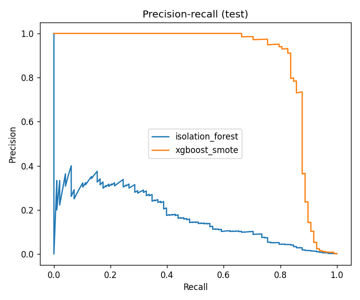
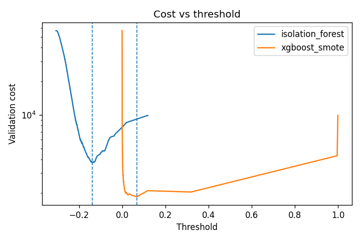
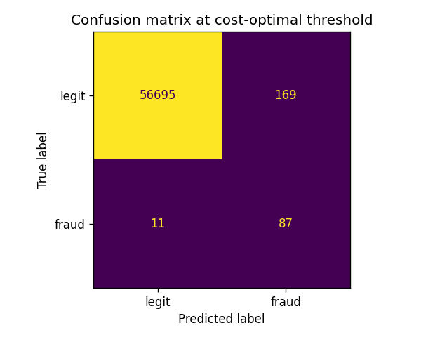

# Fraud Detection — Credit Card Transactions

> **Résumé (FR)** — Détection de fraudes sur 284 807 transactions (0,17 % de fraudes). Comparaison d'un Isolation Forest non supervisé et d'un XGBoost entraîné avec SMOTE. Le seuil de décision minimise un coût métier (une fraude manquée coûte 100 fois une fausse alerte) au lieu du seuil arbitraire de 0,5. Sur le jeu de test, XGBoost attrape 88,8 % des fraudes et divise le coût par 7,7 par rapport à l'absence de détection.

## Problem
Flag fraudulent card transactions while keeping the number of false alerts manageable for investigators.

## Data
[Credit Card Fraud Detection](https://www.openml.org/d/1597) (OpenML 1597; ULB Machine Learning Group): 284,807 transactions, **492 frauds (0.173 %)**. Features V1–V28 are anonymised PCA components; `Amount` is the transaction amount. OpenML marks `Time` as an ignored attribute, so it is not used.

## Approach
- **Split 60 / 20 / 20** (train / validation / test), stratified on the fraud label.
- **Isolation Forest** — unsupervised, contamination set to the training fraud rate.
- **XGBoost + SMOTE** — frauds oversampled to 10 % of legitimate transactions, **inside the pipeline so only training data is resampled**.
- **Threshold chosen on validation** by minimising `cost = 100 × missed frauds + 1 × false alerts`. The 100:1 ratio is an explicit, adjustable business assumption. The test set is used once, for the final numbers.

## Results (test set, 56,962 transactions, 98 frauds, at each model's cost-optimal threshold)

| Model | Precision | Recall | F1 | PR-AUC | Alerts | Cost |
|---|---|---|---|---|---|---|
| Isolation Forest | 0.0459 | 0.7959 | 0.0868 | 0.1748 | 1,699 | 3,621 |
| **XGBoost + SMOTE** | **0.3398** | **0.8878** | **0.4915** | **0.8709** | **256** | **1,269** |

Flagging nothing would cost **9,800** (98 missed frauds × 100).

**Reading the trade-off:** because a missed fraud is assumed to cost 100 false alerts, the optimal threshold is low: XGBoost raises 256 alerts to catch 87 of the 98 frauds, so about one alert in three is a real fraud. With a lower cost ratio the threshold would rise, giving higher precision and lower recall.





## Limitations & next steps
- The 100:1 cost ratio is an assumption; real costs depend on fraud amounts and investigation cost (an amount-weighted cost would be a natural next step).
- The random split ignores time ordering; a time-based split would be more realistic for production.
- PCA features prevent any business interpretation of the drivers.

## How to run
```bash
python -m venv .venv
.venv/Scripts/activate          # Linux/macOS: source .venv/bin/activate
pip install -r requirements-dev.txt
python run.py                   # a few minutes on CPU
pytest
```

## Project structure
```
src/fraud_detection/   config · data · threshold (cost & metrics) · models · plots
notebooks/01-eda.ipynb   imbalance, amounts by class, why PR-AUC
reports/               metrics.json + figures (generated by run.py)
tests/                 fast unit tests on synthetic data (run in CI)
run.py                 full pipeline
```
